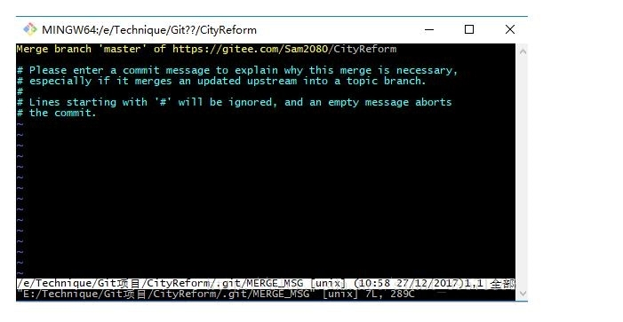

# git使用

<!-- toc -->

### 从git地址将项目clone下来

命令：

`git clone **git库的地址**`

可同时指定分支，命令：

`git clone -b feature/thds **git库的地址**`

若此时指定分支，此后的`pull  push`等操作可不再指定

### 更新、提交文件

##### 更新

命令：

`git pull`

如`clone`的时候指定了分支，此处可以不再指定，否则需要在`pull`的后面指定分支

##### 提交文件

1. 先将本地修改的文件提交到暂存区

	命令： 

	`git add .`  

	这里的`. `表示提交所有修改的文件

2. 从暂存区提交到本地库

	命令：

	`git commit -m "本次提交代码的备注" `

	必须写`-m`，否则会报错

	执行完此命令后，可能会出现vim编辑器窗口

	

	相关使用方法见这里：

	https://blog.csdn.net/sinat_39571186/article/details/78911814

	如果没有什么操作要执行，直接退出的话，敲`:wq`然后回车即可

3. 从本地库提交到远程库

	命令：

	`git push`

	如`clone`的时候指定了分支，此处可以不再指定，否则需要在`push`的后面指定分支

### 其他命令

1. 查看当前连接的远程库

	命令：

	`git remote -v`

2. 查看所有分支

	命令：

	`git branch -a`

	带有*号的表示当前所在分支

	

3. 查看当前使用分支

	命令：

	`git branch`