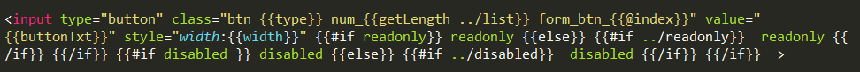

# handlebars文档

<!-- toc -->

目前常用的模板引擎（这里仅指浏览器端的，不包括node的）有很多种，有的已经有很多年了历史了……比如`handlebars`、`artTemplate`、`Template.js`、`baiduTemplate`、`juicer`、`doT`等等等等……目前不知道有没有已经废弃的 :sweat_smile:

作为一个模板引擎，最基本的功能就是用给定的数据渲染模板，生成最终的`html`结构，在这个功能的基础上，每个模板引擎分化出了不同的语法和用法，这里是`handlebars`的一篇常用知识点解说文档……


### 说明一下handlebars的使用方法

有三个步骤：

1. `html`文件中，引入`handlebars`模板的js文件

2. 准备用来数据渲染的`handlebars html`模板

3. `js`中，获取此模板并用数据渲染，再塞到页面上，基本有四句：

	```
	var source = $('#contentList').html();
    var template = Handlebars.compile(source);
    var html = template(data);
    $('.content_list').html(html);

	```

	* 第一句，获取`$('#contentList').html()`并赋值给`source`变量，此时`source`变量应该为一段使用`handlebars`方法写出来的`html`代码

	* 第二句，通过`Handlebars.compile()`，将`source`的内容初始化为`handlebars`模板，此方法会返回一个函数，赋给了`template`变量

	* 第三句，通过`template`方法，结合传递的参数数据`data`，handlebars会把`data`和模板`source`的内容结合起来，渲染出最终的`html`片段，赋给了`html`变量

	* 第四句，拿到渲染结果后，这里将`html`放到了`$('.content_list')`中

	当然啦，以上四句也可以结合起来，成为

	```
	$('.content_list').html( Handlebars.compile( $('#contentList').html() )(data) );
	```

	以上是完整的渲染`handlebars`模板的逻辑，可以发现，在`Handlebars.compile()`之前，只要获取到作为模板的`html`片段即可，因此一段`handlebars`模板有两种创建方式

		- 放在html文件中，用`<script>`标签包含起来

			此时需要给`<script>`标签设置属性`type="text/x-handlebars-template"`和`id=****`，`id`属性也可以改成`class`，总之是可以用`js`获取节点使用的，在`js`中获取的时候，需要用
			`$(***).html()`的方式，如

			

		- 放在单独的html文件里，此时不要用`<script>`标签包含，如

			 
			
			需要在用到该模板的`js`文件中作为`html`片段引入，如`var errHtml = require( 'html-loader!../../../error/views/handlebar_error.html');`，在渲染模板时，直接使用`errHtml`变量

### 接下来是handlebars html模板的语法

`handlebars`作为模板引擎，可以使用各种类型的数据进行渲染，在写模板时，对于变量，循环，`if/else`等，都有对应的使用方法，这些基本语法可以参考网上的`handlebars`教程，这里附一些链接~

> handlebars官网：http://handlebarsjs.com/

> 教程一：https://www.cnblogs.com/iyangyuan/archive/2013/12/12/3471227.html

> 教程二：http://www.ghostchina.com/introducing-the-handlebars-js-templating-engine/

下面主要说明`handlebars`的`helper`和其他一些概念

##### \{\{\}\}和\{\{\{\}\}\}和\{\{> \}\}

1. 如果要使用变量的话，要在变量外面用\{\{\}\}括起来，这样handlebars在解析模板时，会把它作为变量解析，此时如果变量内容包含了`html`节点，只会作为字符串渲染出来，不会作为`html`节点存在

2. 如果变量是用\{\{\{\}\}\}括起来的，如果变量内容包含了`html`节点，才会作为`html`节点存在，因此如果数据中含有`html`节点，记得用\{\{\{\}\}\}

3. \{\{> \}\}用来在模板里调用`partial`，`partial`的作用会在下面说明~ :satisfied:

##### 块的概念，和../

`handlebars`有块级的概念，在模板里，每个`#`就表示当前是一个局部块，每个块都有自身的作用域范围

看到`../`的时候，很容易想到“路径”，就像`js`或`less`文件在引入其他文件时写路径的方式一样，`handlebars`也支持这种方式，用来寻找数据，比如：

当一组数据是这个样子的：

```
	var list = {
		name: 'abc',
		content:[{
			type: 1,
			length: 2
		},{
			type: 2,
			length: 3
		}]
	}
```

在循环`content`数组时，通常会使用`#each`或是`#block（block表示当前块，也就是需要处理的数据的名字，在这里就可以是#content）`的方式，此时在当前作用域里，是找不到与`content`同级的`name`的，那么要使用`name`怎么办呢？使用`../`

一个`../`表示跳出一层，与文件路径的寻找是一样的，两个`../`就表示跳出两层，可以叠加

##### helper和partial

因为`handlebars`的`html`模板的语法不太全面，有很多功能无法实现，所以出现了`helper`和`partial`这种东西，相当于在`js`中给`handlebars`添加了一个新的可公用的方法，在`html`模板里按照正确的使用方法书写，`handlebars`在渲染模板时就会自动调用这些方法，生成正确的模板

1. 先说一下`helper`：

	`if、each、unless、with`等是`handlebarrs`内置（自带）的`helper`，除了这些之外，还可以自定义`helper`，声明一个`helper`的方法是`Handlebars.registerHelper()`，如：

	```
		Handlebars.registerHelper('getLength', function(options) {
				return options.length;
		});
	```

	这就是声明了一个名叫`getLength`的`helper`，`Handlebars.registerHelper()`可以传参，第一个参数是`helper`的名字，第二个参数是一个`function()`，里面是`getLength helper`需要处理的逻辑，该函数可以传参

	还可以使用`this`：
	```	
		Handlebars.registerHelper('getLength', function(options) {
				return options.fn(this);
		});
	```

	这个`this`是渲染当前作用域块的数据

	---

	在模板中给`helper`传参时需要注意：

	- 调用一个`helper`并传参的方法：\{\{`helper的名字  传参`\}\} ，如：

		 

		`getLength`就是上面声明的那个`helper`，后面的`../list`是给这个helper传递的参数，其中`../`是用来寻找上一级数据的，外部的大括号`{}`根据实际情况判断是用两个还是用三个

		这样写好之后，在模板渲染时，就会自动去寻找`getLength helper`并传递参数`../list`，在`getLength`里处理好了之后，`getLength`里有一个`return`用来返回处理后的数据，把这个数据替换掉模板里红色框起来的部分~

	- 传参的参数类型不止一种

		```
			1. 传递一个字符串
			getLength 'txt'

			此时txt只是单纯的字符串

			2. 传递一个数据
			getLength ../list

			此时list是渲染模板的数据中的某一项，getLength中可以直接使用此数据做处理

			3. 传递一个带=的自定义数据
			getLength class="red"

			此时class="red"不是一个纯粹的字符串，也不是数据，getLength中也不是用参数接收它的，而是在hash()中，这个hash()下面部分在解析helper的参数时介绍~
		```

	- 可以不传参数，也可以传一个参数，也可以多传

		以上面的`getLength`为例，有一个参数是`options`，用来接收外部传递的参数，但是外部在调用`getLength`的时候，可以不传，也可以传一个参数，也可以多传，如：

		```
			1. 不传
			getLength

			2. 传一个参数
			getLength ../list

			3. 多传
			getLength ../list name type
			或者 getLength 'txt' 'str'
			或者 getLength class="red" href="javascript:;"

			4. 多种类型的参数结合起来传
			getLength 'txt' name class="red"
			此时第一个参数为字符串'txt'，第二个参数为数据name，第三个参数是一个带=的自定义数据

			三种传参类型都可以有多个，字符串和数据类型的参数位置无要求，但注意自定义数据一定要写在所有数据的最后
		```

	- helper中接收参数的方式

		* 不写任何接收参数

			也就是说，上面声明`getLength`时，不设置`options`：

			```
				Handlebars.registerHelper('getLength', function() {
						return this.name;
				});
			```

			此时没有任何接收参数，但function里可以使用`this`

		* 有参数

			** 这里要注意 **：`handlebars`总会给第一个没有值的接收参数设置一个默认的数据，这个数据是一个对象，包含了很多东西~

			就比如第一次声明的`getLength`中的`options`，此时只有一个接收参数，若外部没有传参，handlebars会给`options`设置这样一个默认值：

			 

			> 这个对象有五个属性：`data fn hash inverse name`

			> 其中`data`和`name`、`hash`是通常任何情况下都会有的，`fn`和`inverse`视情况出现，而`fn`和`inverse`不出现的时候，`hash`只是一个空对象，没有数据

			若是接收参数有多个，外部传的参数也有多个，如：

			```
				Handlebars.registerHelper('getLength', function(list, name, options) {
						return this.name;
				});
			```
			:one: 如果模板里只传了一个参数，即只给`list`赋值，那么`name`就是`handlebars`提供的默认数据

			:two: 如果模板里传了两个参数，即只有`options`没有被赋值，那么就作为`handlebars`提供的默认数据

			:three: 但如果模板里在使用getLength时传了三个参数，可以与这里的`list, name, options`一一对应起来，那么这个函数里就没有上面所说的`handlebars`提供的默认数据的存在了

			---

			在有`handlebars`提供的默认数据时，这里暂时把它叫做options

			:smile: 先说明一下`data`和`name`:

			`data`：渲染模板的数据

			在这个`data`里，有一个`root`，是渲染整个模板的所有数据，这个数据与this不一样，是整体的哦~不是只针对当前`helper`的，所以可以用`options.data.root`取得所有数据

			`name`: 当前`helper`的名字

			:smile: 接着说明一下`hash`:

			`hash`: 是一个对象，用键值对的方式保存模板中传过来的带`=`的自定义数据

			:smile: 最后，说明一下`fn`和`inverse`:

			`fn`: 一个方法，需要传参，如传的是`this`：即`options.fn(this)`时，返回使用this渲染之后的模板

			`inverse`: 也是一个方法，需要传参，作用跟`fn`一样，也是返回一个渲染数据后的模板，但是与`fn`不同的是，`inverse`是取反的。。。具体取反是什么效果，请自行试验 :smiling_imp:

			:smile: 最最后，说明一下`fn`和`inverse`不出现及`hash`无值的情况:

			当一个`helper`被使用时，如果它是一个`block`块的方式被使用，也就是被\{\{`#getLength`\}\}这么使用时，options是有`fn`和`inverse`的，`hash`也是有数据的，而如果不这么使用，比如在模板中直接调用时，也就是\{\{`getLength`\}\}这样使用时，就没有`fn`和`inverse`了，`hash`也没有数据了

2. 说一下`partial`：

	声明一个`partial`的方法：`Handlebars.registerPartial()`，如：

	```	
		
		Handlebars.registerPartial('userMessage',
    		'<{{tagName}}>By {{author.firstName}} {{author.lastName}}</{{tagName}}>'
    		+ '<div class="body">{{body}}</div>');
    	
	```

	可以看出来，这个方法与声明`helper`是不一样的，虽然也能接收两个参数，第一个参数是`partial`的名字，第二个参数却不是`function()`了，而是一段`handlebars`的`html`模板，这个函数不需要`return`返回什么东西，而是直接把结果替换掉模板里写着\{\{\>`userMessage`\}\}的部分~

	而在模板里调用`partial`的时候，需要用\{\{\>`partial名称`\}\}的方式，多一个`>`哦


** end~ **