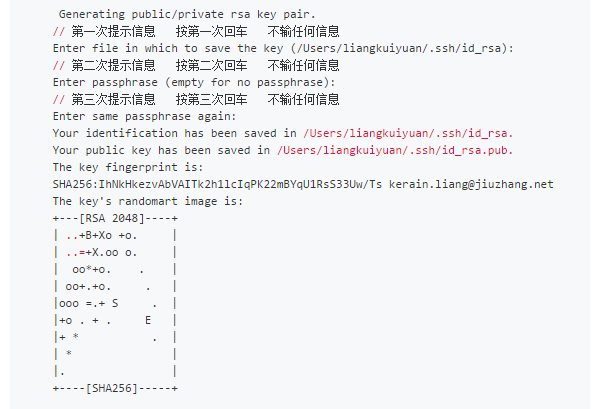
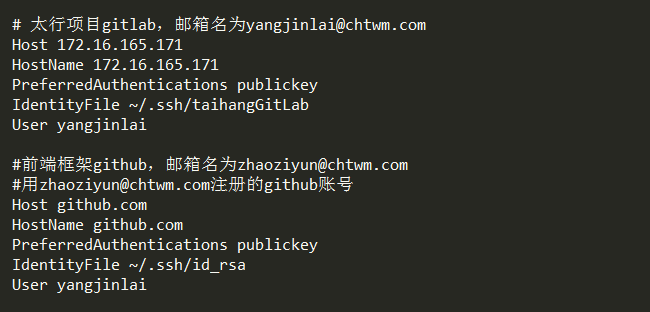
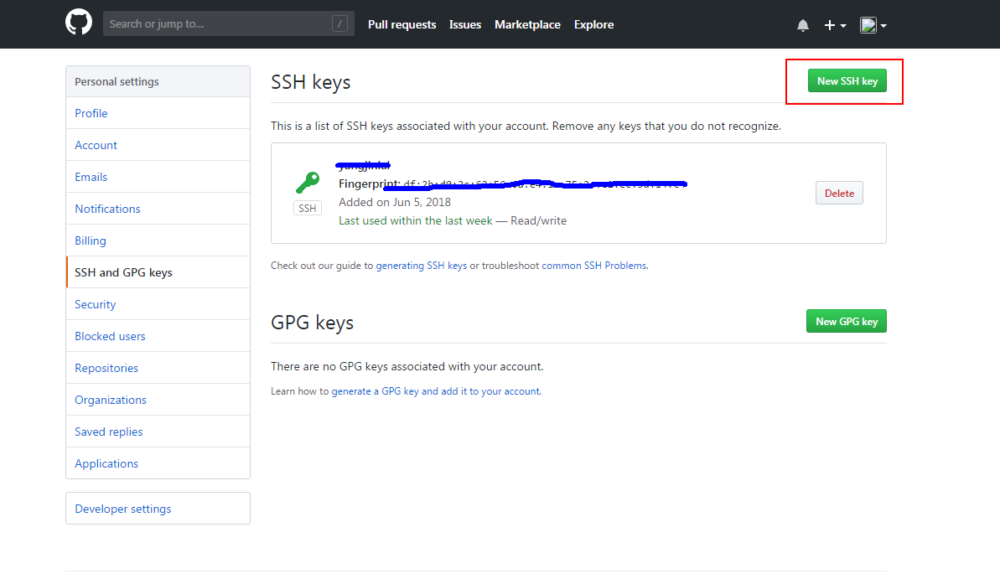
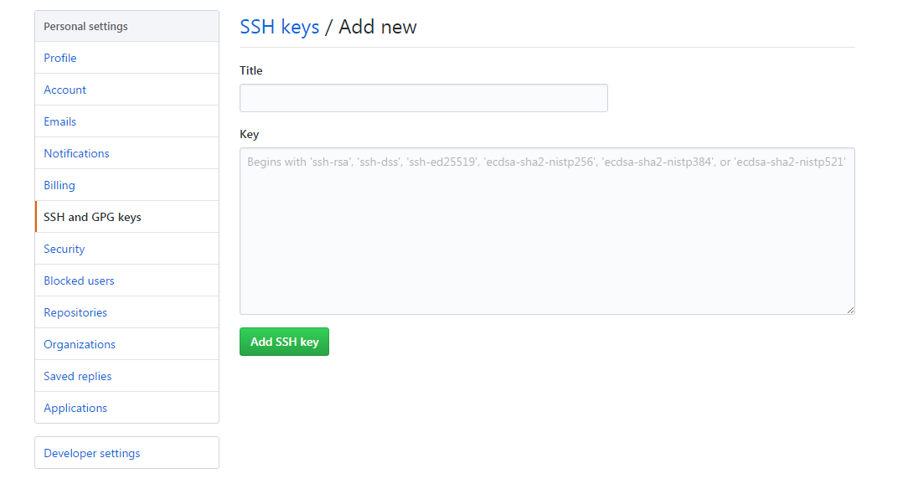
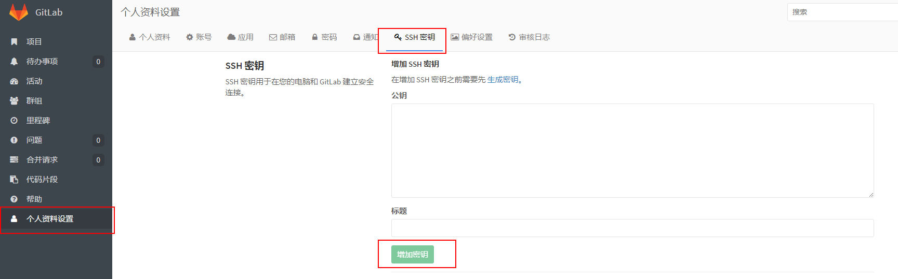

# sshkey生成及配置

<!-- toc -->

如果使用`git`控制代码的话，需要在本地电脑上生成`sshkey`，并同账户绑定


### 什么是sshkey

`SSH`全称(`Secure SHell`)是一种网络协议，顾名思义就是非常安全的`shell`，主要用于计算机间加密传输。

`SSH`的主要目的是用来取代传统的`telnet` 和` R` 系列命令（`rlogin, rsh, rexec `等）远程登录和远程执行命令的工具，实现对远程登录和远程执行命令加密，防止由于网络监听而密码泄露问题。

### 生成sshkey

因可能有多个`git`或`gitlab`等的账户需要建立`sshkey`，若不进行配置，会导致平台上配置了正确的公钥，和自己的电脑连接时却对应着第一个sshkey的私钥，不匹配，所以需要对多个sshkey的情况进行处理（即如下建立config配置文件）

若一个电脑上只有一个`sshkey`，可能不用进行第三步配置`config`文件就能成功连到项目git服务上，但若是多个`sshkey`，则需要配置`config`

##### 生成

1. 随便什么文件夹，右键，打开`git bash`，敲命令： 

	`ssh-keygen  -C "邮箱"  -f  "文件名称"`

	邮箱地址----`github`或`gitLab`等平台的账号

	文件名称----随便什么名字，作为生成的`sshkey`的文件名

	过程如下：

	

	会有提示设置密码等，一路回车不要设置，否则以后操作文件的时候每次都会让输入密码。。。

2. 若一切正常，文件夹`C:\Users\用户名`里应该有个文件夹叫做`.ssh`，里面有刚刚生成的`sshkey`的两个文件
		
	* 一个是没有后缀名的文件，是sshkey的私钥
	* 一个是有`.pub`后缀名的文件，是公钥，添加到`git`上的就是这个公钥

3. 可能出现的问题：

	* 若这两个文件没有生成到`C:\Users\用户名`里，而是生成到了打开`git bash`的目录，此时需要看一下`C:\Users\用户名`里有没有`ssh`这个文件夹，如果没有，需要手动建

	建立方式：新建文件夹，修改文件夹名字为`.ssh.`

	然后在这个`.ssh`文件夹里，打开`git bash`，再次执行`ssh-keygen  -C "邮箱地址"  -f  "文件名称"`命令

	* 提示让输入`password`，或提示没有权限，`established`等，需要进行第三步配置

##### 验证sshkey是否可用
	
在`git bash`上执行命令`ssh -T git@****`

正常如下：


可能出现的问题：

* 提示让输入`password`，或提示没有权限，`established`等，需要进行第三步配置

##### 配置

在`.ssh`文件夹里，新建一个文件为`config`，不要后缀名

打开config，添加一条配置如下：

```
	Host 172.16.165.171
	HostName 172.16.165.171
	PreferredAuthentications publickey
	IdentityFile ~/.ssh/taihangGitLab
	User yangjinlai
```

有五项内容

* Host---刚刚生成的sshkey对应的服务
* HostName---和Host写一样的即可
* PreferredAuthentications---默认就写publickey
* IdentityFile---刚刚生成的sshkey文件名（不要带后缀）
* User---git的用户名

查看`git`用户名的方法：`git bash`里执行`git config --global user.name`

如这个`config`文件里有两条配置（#开头的语句为注释）：



### 将sshkey添加到git/gitlab等项目上

##### 以git为例



打开账户的`settings` -->  `SSH and GPG keys` --> New SSH key按钮

点击这个按钮，添加一个新的`ssh key`



刚刚生成的`sshkey`在这个路径下：

`C:\Users\用户名\.ssh`

打开刚刚生成的有`.pub`后缀名的文件，复制里面的内容，粘贴到`key`文本框中，`title`可以随便起名，点击`Add SSH key`就可以了

##### 以太行项目的gitLab为例

登录太行项目的gitLab后，点击个人资料设置-->SSH密钥



同上面说的一样，将生成的有`.pub`后缀名的文件里的内容复制粘贴到**公钥**文本框中，标题可以随便起，点击**增加密钥**按钮即可

