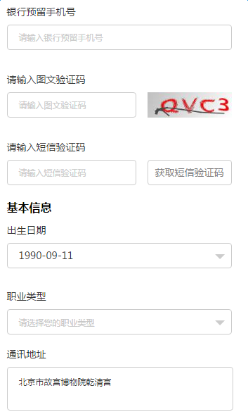

# 表单元素及基本结构

### 表单元素

如下图：  

  

这就是一个表单：

银行预留手机号、图文验证码、短信验证码、出生日期、职业类型、通讯地址

可以看出，每一行都是不同的，也许是`input`输入框，也许是下拉数据选择，也许是`textarea`，不论是什么，内容都是不一样的，也就是说，提交给服务器都是不同字段的数据。

因此，这里将**每一行叫做一个表单元素**，不同的元素**根据内容（数据）做区分**。

### 表单组件的使用方式

1. 需要引入`check.less`或`check.css`，并引入表单内元素事件绑定的`formEvent.js`，具体使用方法见[formEvent.js说明](pc/uiFrame/formEvent.md)

2. 使用框架提供的`DOM`结构书写表单

###  表单`DOM`结构

表单元素有很多种类，相应的，`DOM`结构也有很多不同：

1. 有的表单元素一行内只有一个输入框，有的一行内是输入框+图片，如图文验证码，还有的是输入框+按钮，如短信验证码

2. 有的表单元素的`label`上还有红色的*标志

3. 有的表单元素是下拉选项

4. `input`输入框需要x按钮，提供清除内容的功能，下拉列表是不需要x按钮的

表单元素有共同的基本`DOM`结构，在此基础上对这些不同进行扩展。

基本`DOM`结构如下：

```
<!-- 表单容器，所有的表单元素都需要放在inputDom这个容器里 -->
<div class="inputDom">	
	<!-- 一个表单元素 -->
	<div class="card-input-row">
		<!-- 该表单元素的label -->
	    <label>该表单元素的label</label>
	    <!-- 下面的DOM结构，input textarea和下拉选项是不同的-->
	    <!-- input有输入框，textarea是一个textarea文本框，下拉列表是下拉组件的结构 -->
	    <!-- 还可以在这里添加校验不通过的错误提示error-tip的DOM结构-->
	    <!-- 这里只介绍基本结构，详细的讲解请看对应的文章介绍 -->
	</div>
</div>

```

说明：

1. 表单容器`inputDom`，所有的表单元素都需要放在inputDom这个容器里

2. 每一个`card-input-row`是一个表单元素，占一行，表单元素需要放在容器`inputDom`中

3. `label`是该表单元素的label，根据需求来写，每个表单元素是不同的

4. 剩下的`DOM`结构根据不同的表单元素有不同的内容，具体讲解见对应文章~

5. 表单组件提供了输入框内容修改时，出现`x`清除内容的按钮，输入框失去焦点时，`x`按钮隐藏的事件。使用需要引入`formEvent.js`，同时为`input`输入框添加`needCheck=true`属性（必须），否则`formEvent.js`中不会为该输入框绑定事件

6. 在输入框获取焦点时，表单组件会为其添加获取焦点时的样式：黄色边框及阴影，失去焦点时该样式也消失
