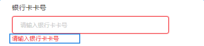
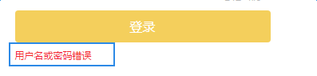

# 错误提示

用于表单校验出现错误、`ajax`请求出现错误等情况，将错误提示显示在页面上，如图：

   

点击这个按钮看看：

<iframe src="./demo/errorTip/errorTip.html" width="600px" height="200px" frameborder="0" scrolling="no" style="border: 1px dashed #ccc;padding: 20px;"> </iframe>

说明：

1. 需要引入`errorTip.less`

2. `DOM`结构：

```
<p class="error-tip">这是一条错误提示</p>

```