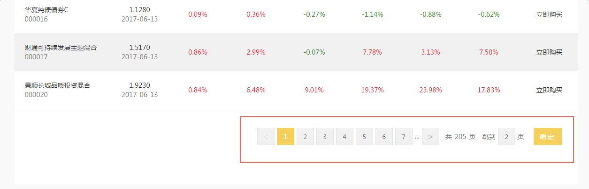

# 分页

如图：



使用方法：

1. 引入`paging.js`

2. 在页面上放入`DOM`结构

```
<div class="kkp clearfix">
	<div id="kkpager"></div>
</div> 
```

2. 调用方法：

```
//调用分页插件
kkpager.generPageHtml({
	pagerid: ,
	pno :  , //当前页码
	total : ,  //总页码
	totalRecords : ,  //总数据条数
	mode : 'click',  //点击事件
	click : function(m){ //页码的点击事件

		//手动选中按钮
		this.selectPage(m);
	}
});
```

注：
金服、企金的分页样式上有不同
目前金服已开始随需求迭代新版本分页，企金没有需求迭代，还保持为旧版本