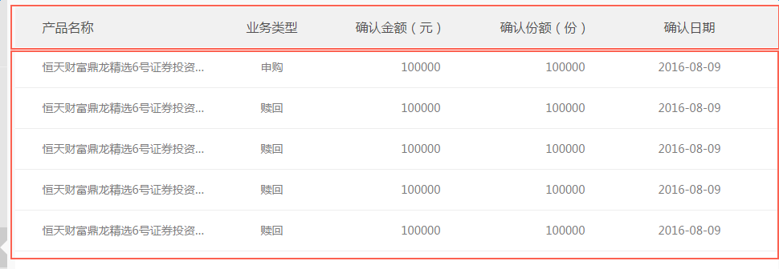

# 表格

如图：

 

第一行灰色底为表头，表头下方为表格内容。使用方法：

1. 引入`table.less`或`table.css`

2. `DOM`结构如下：

```
<div class="tableWrapper">
	<!-- 表头 -->
	<ul class="tabHead clearfix">
		<li class="p1 align_lt">产品名称</li>  
		<li class="p2">业务类型</li>
		<li class="p3">确认金额（元）</li>
		<li class="p4">确认份额（份）</li>
		<li class="p5">确认日期</li>
	</ul>
	<!-- 表头 end-->
	<!-- 表格内容 -->
	<div class="tabBody">
		<div class="tabBox">
			<div class="tabWrap">  
				<a href="javascript:;" class="link">
					<ul class="tabBody clearfix">
						<li class="p1 flow align_lt">恒天财富鼎龙精选6号证券投资基金</li>
						<li class="p2">赎回</li>
						<li class="p3 align_rt align_2">100000</li>
						<li class="p4 align_rt align_2">100000</li>
						<li class="p5">2016-08-09</li>
					</ul>
				</a>	
				<a href="javascript:;" class="link">
					<ul class="tabBody clearfix">
						<li class="p1 flow align_lt">恒天财富鼎龙精选6号证券投资基金</li>
						<li class="p2">赎回</li>
						<li class="p3 align_rt align_2">100000</li>
						<li class="p4 align_rt align_2">100000</li>
						<li class="p5">2016-08-09</li>
					</ul>
				</a>	
			</div>							
		</div>
	</div>
	<!-- 表格内容 end-->
</div>
```