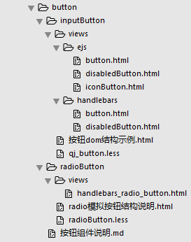

#按钮组件

<!-- toc -->

先来看下效果：

<iframe src="../../demo/button/button_4.html" height="80px" frameborder="0" scrolling="no" style="border: 1px dashed #ccc;"> </iframe>

<iframe src="../../demo/button/b_5.html" height="130px" frameborder="0" scrolling="no" style="border: 1px dashed #ccc;"> </iframe>

企金项目的按钮基本上长这个样子，这里对按钮组件的分类及文件简单说明一下，详情及使用方法见对应类别的文档~ :laughing:

### 按钮组件文件说明

##### 没有单选效果

使用`input button`或`div`模拟按钮，有`ejs`和`handlebars`模板

1. ejs模板

	* `ejs/button.html` —— 基本按钮的模板

	* `ejs/disabledButton.html` —— 不可点击的按钮模板

	* `ejs/iconButton.html` —— 带`icon`的按钮模板

2. `handlebars`模板
	
	* `handlebars/button.html` —— 基本按钮的模板

3. `qj_button.less` —— 按钮组件的样式 

##### 有单选效果的

使用`input radio`模拟按钮，带有单选效果，有`handlebars`模板`handlebars_radio_button.html`

* `handlebars_radio_button.html` —— 基本按钮的模板

* `radioButton.less` —— 按钮组件的样式
