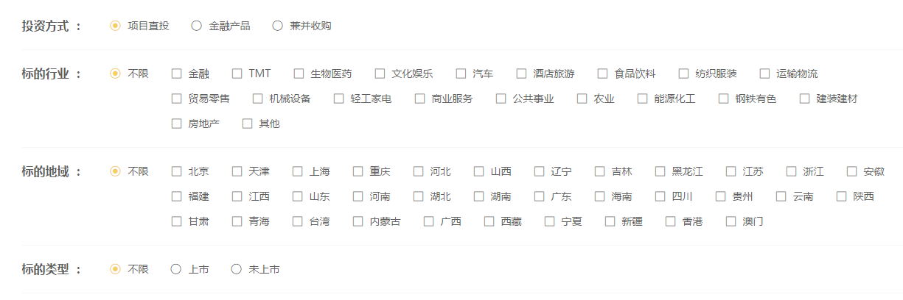
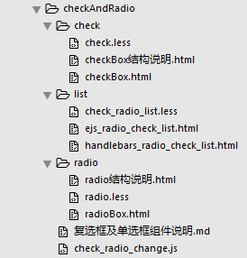

# 单选/复选

<!-- toc -->

先来看下效果：

有单选，有复选，单选和复选可以组合在一起使用

单选组件使用`input radio`模拟，复选组件使用`input checkbox`模拟

### 组件文件说明

组件的整体文件夹名字叫做`checkAndRadio`

1. `check`文件夹

	放置复选组件的相关文件

	`check.less` —— 样式文件

	`checkBox.html` —— 复选组件的`handelbars`模板

2. `list`文件夹

	放置单选+复选组合的相关文件

	`check_radio_list.less` —— 样式文件

	`ejs_radio_check_list.html` —— 单选+复选组合的`ejs`模板，目前没有内容 :sweat:

	`handlebars_radio_check_list.html` —— 单选+复选组合的`handlebars`模板

3. `radio`文件夹

	放置单选组件的相关文件
	
	`radio.less` —— 样式文件

	`radioBox.html` —— 单选组件的`handelbars`模板

具体使用方法见对应文档~