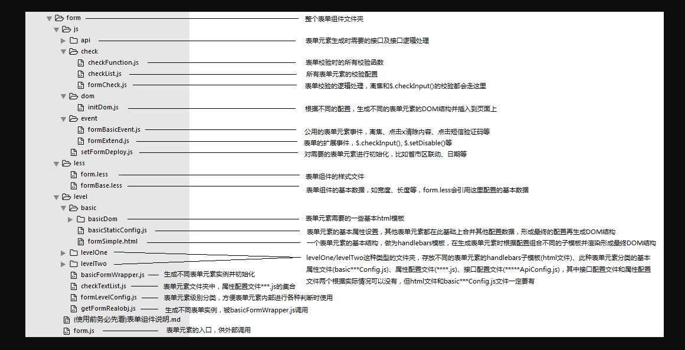
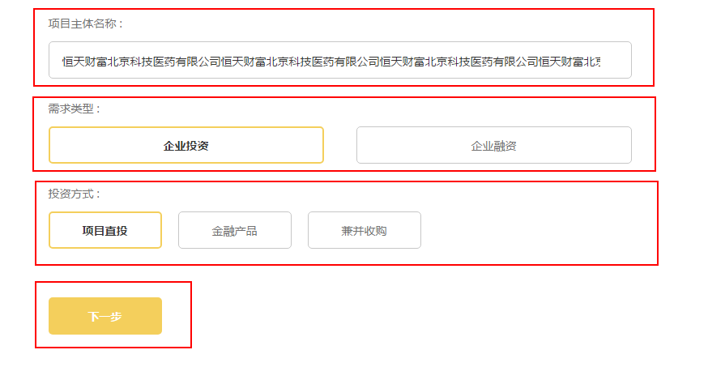
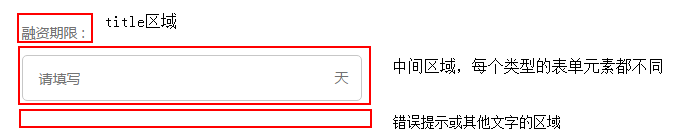
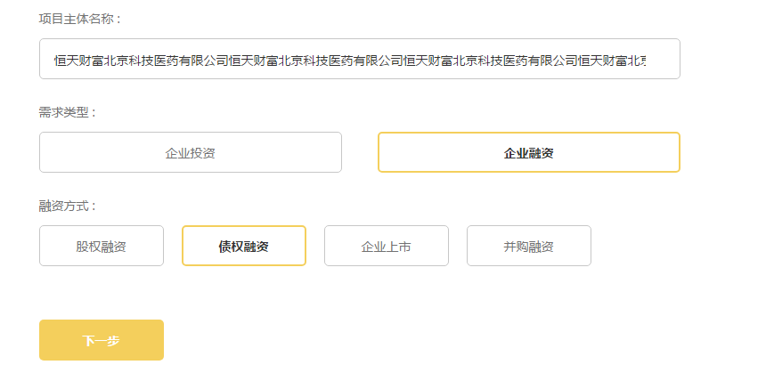
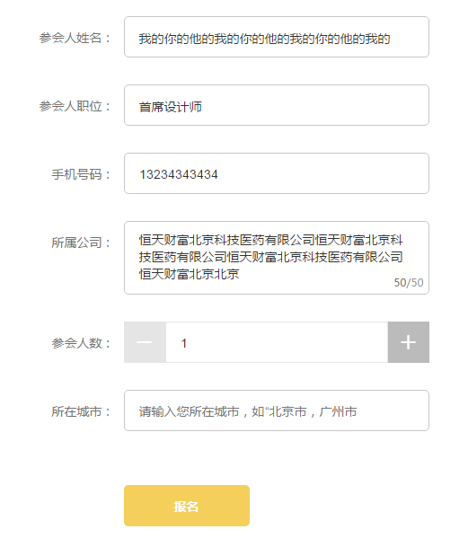

# 表单组件简介

表单有多种样式，也有多种表单元素，每种表单元素可绑定不同基本事件，可以通过配置灵活使用

### 表单组件的重要文件介绍

以上是表单组件的基本文件目录

### 表单组件逻辑简单说明

1. ** 每个表单是由一个或多个表单元素组成的，表单元素有多种类别，不同种类的表单元素组合在一起形成一个表单 **

	一个表单示例（发布项目页面的第一个表单）：

	

	每一个红框里都是一个表单元素，这个表单总共有四个表单元素，从上到下分别是：`input`类型、`formButton`类型、`formButton`类型和`submitButton`类型  

2. ** 每一个表单元素，虽然属于不同的类型，但都有如下几个基本结构（基本结构的`handlebars`模板写在`formSimple.html`中）**

	

	* title区域，显示该表单元素的title，可配置是否显示，可配置是否有`*`和冒号（`submitButton`类型的表单元素除外，因为这种表单元素不会有`title`）  

	* 中间区域，是该表单元素的主要区域，每个表单元素都不同，如`input`类型此处为一个input输入框，`formButton`类型此处为按钮，`checkBox`类型此处为单选或多选项  

	* 错误提示或其他文字区域，用来显示错误提示，或是'获取语音验证码？'、'忘记交易密码'等文字，或是其他需要在此处显示的任意内容（目前没有，需要有需求的时候添加此功能）  

3. ** 根据UI图，title区域和中间区域可以是上下的，也可以是左右的，所以形成了两种不同的表单样式 **

	* 上下（竖直）表单
	
		

		这个表单里的表单元素，`title`区域和中间区域是上下布局的（`submitButton`类型的表单元素，也就是底下那个黄按钮不算在内），所以是上下（竖直）表单

	* 左右（水平）表单
	
		

		这个表单里的表单元素，`title`区域和中间区域是左右布局的（`submitButton`类型的表单元素，也就是底下那个黄按钮不算在内），所以是左右（水平）表单

4. ** 配置、样式、校验等其他内容见对应文件~ **