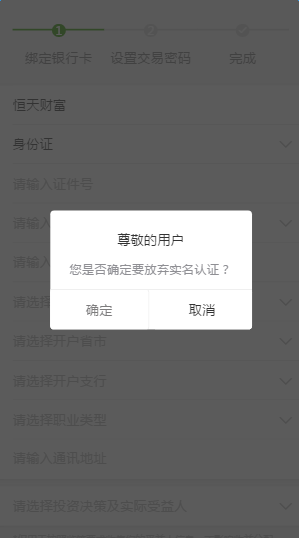

# 确认离开当前页面并弹出确认弹框

可浏览器后退按钮的点击，并在当前页面弹出“是否离开当前页面”的弹框，用户如选择确定，则回到上一个页面，用户如选择取消，则停留在当前页面。

效果：



使用方法：

1. 除使用弹层需要的文件外，还需要引入`js`文件`ConfirmAwayNowPage.js`

2. 页面打开时需初始化

```
ConfirmAwayNowPage( '弹层上的文案', '点击确定按钮跳转的url' );
```

然后点击浏览器的后退按钮，就会显示这个弹层啦

