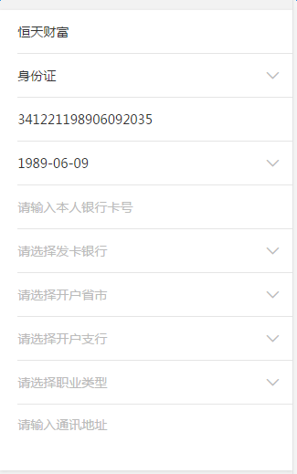

# 表单元素及基本结构

表单组件建立在列表组件和选择器picer的基础上，因此在阅读本文时，请先阅读列表组件和选择器picer的内容~

       

上面这两个图，都是表单：

图一：手机号、图文验证码、短信验证码、密码、确认密码、理财师工号

图二：姓名、证件类型、证件号码、生日、银行卡号……

可以看出，在表单中，每一行都是不同的，也许是`input`输入框，也许是选择器，不论是什么，内容都是不一样的，也就是说，提交给服务器都是不同字段的数据。

因此，这里将**每一行叫做一个表单元素**，不同的元素**根据内容（数据）做区分**。

### 表单元素的分类

表单元素有很多种类，相应的，`DOM`结构也有很多不同：

表单元素可分为两种：

1. 输入类（`text、password、textarea`等）

2. 选择类（证件类型、发卡银行、生日等），点击出现选择器，用户可选择而不可输入

输入类的表单元素，结构都可以分为三个区域，从左到右分别为：

1. 左边`icon`

2. 输入区

3. 右边`icon`（眼睛、帮助？的图标等）/图文验证码的图片/短信验证码的按钮

其中，第2个区域是肯定存在的，而第1和第3个区域是有的表单需要，有的表单不需要的，因此需要分别处理。

表单元素有共同的基本`DOM`结构，在此基础上对这些不同进行扩展，详情请看对应的文章介绍~


### 表单组件的使用方式

1. 引入表单组件的样式文件`newFormMui.less`

2. 使用框架提供的`DOM`结构书写表单

###  表单容器的`DOM`结构

```
<!-- 表单容器，所有的表单元素都需要放在inputDom这个容器里 -->
<div class="form-wrap">
	<!-- input textarea和下拉选项的DOM结构是不同的-->
    <!-- input有输入框，textarea是一个textarea文本框，下拉列表是下拉组件的结构 -->
    <!-- 还可以添加校验不通过的错误提示error-tip的DOM结构-->
    <!-- 这里只介绍基本结构，详细的讲解请看对应的文章介绍 -->
</div>

```
