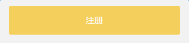
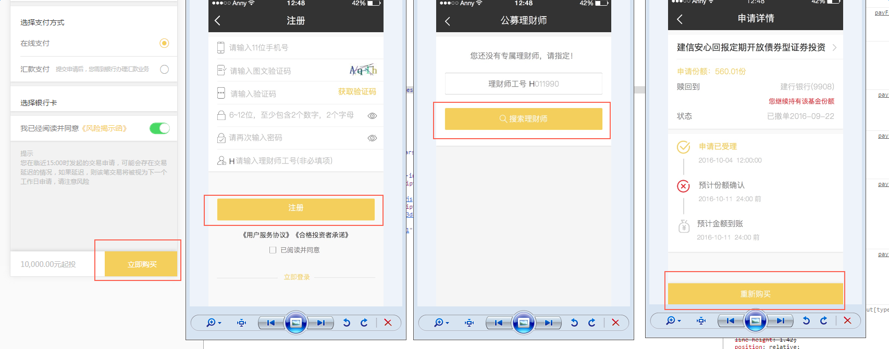
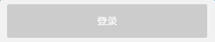

# 按钮

基于mui的按钮，并在此基础上做了适应移动端项目的样式重置。需要引入按钮样式文件`button.less`

###  基本的结构和样式

移动端项目中，按钮样式有默认的样式：**黄色背景、圆角、白色文字、点击背景颜色变灰**

如图，这是一个基本的按钮：

  

按钮的结构如下：

```
	<!-- button标签上需要加class为mui-btn -->
	<button type="button" class="mui-btn">注册</button>
```

这时的按钮是没有外边距的。


### 在基本样式上的其他变化

在移动端项目中，按钮的样式在这个基本样式上又有了其他变化，如图：

  

这里有四个黄色按钮，每一个在基本的样式基础上又有了不同变化，具体如下：

1. 按钮和其他节点并列

	保持当前结构不变，根据实际情况设置宽度及其他样式

2. 按钮有外边距，这时有两种情况：

	第一种：按钮在卡片视图外面，此种情况一般有上边距4rem，左右外边距1.6rem

	第二种：按钮在卡片视图内部，此种情况一般上边距不定，左右外边距1.6rem

	```
		<!-- 第一种 -->
		<div class="btnButton">
			<button type="button" class="mui-btn">登录</button>
		</div>

		<!-- 第二种 -->
		<div class="btnButton">
			<button type="button" class="mui-btn">登录</button>
		</div>

	```

	说明：

	两种情况使用同样的结构。

	给按钮添加一个容器，`class`为`btnButton`，这时按钮有了外边距

	对于上边距不定的情况，需要在各自页面的样式文件中对上边距进行重置

3. 按钮固定在页面底部

	```
		<button type="button" class="mui-btn bottom">立即购买</button>
	```

	说明：

	在`button`上为`class`添加一个`bottom`

4. 按钮上面有`icon`

	```
	<button type="button" class="mui-btn hasIcon">查询员工信息</button>
	```
	说明：

	在按钮上添加`class`为`hasIcon`，并在页面css中设置该按钮的`:before`样式的`content`值，eg：

	```
		.mui-btn{
			&:before{
		    	content: '\e66f';
		  	} 
		}
		
	```

5. 按钮不可点击的状态（底色变为灰色）

	```
	<button type="button" class="mui-btn disable">查询员工信息</button>
	```

	说明：

	在按钮上添加`class`为`disable`，并为该按钮添加属性`disabled=disabled`（即`button`标签或`input`标签添加`disabled`属性使其点击无效），效果如图：

	  


