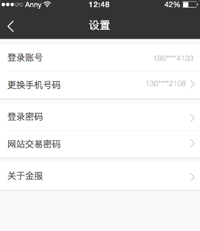

# 卡片视图

### 卡片视图是什么

以设置页面为例，此页面的内容有三个区域：
1. 登录帐号、更换手机号码
2. 登录密码、网站交易密码
3. 关于金服



每个区域都是单独的，有自己的白色背景和边框阴影，互相之间有间距隔开，一个这样的区域就叫做卡片视图。

### 使用方式

在标签上添加`class`属性值`mui-card`，该标签即成为一个卡片视图，卡片视图内可以放置任意内容。需要引入卡片视图的样式文件`card.less`

一个卡片视图具有的样式：
1. 白色背景
2. padding-left：1.6rem;
3. 阴影
4. 字体1.4rem
5. 若多个卡片视图之间有间距，给卡片视图添加`class`属性值`marginTop`
6. 若某个卡片视图的内容是水平居中的，给卡片视图添加`class`属性值`centerWrap`，此时会去掉padding-left

```
	1. 最简单的卡片视图
	<div class="mui-card">
		<!-- 这里是卡片视图的内容 -->
	</div>
	
	2. 带上边距的卡片视图
	<div class="mui-card marginTop">
		<!-- 这里是卡片视图的内容 -->
	</div>

	3. 内容水平居中的卡片视图
	<div class="mui-card centerWrap">
		<!-- 这里是卡片视图的内容 -->
	</div>
	
	4. 又有上边距，内容又水平居中
	<div class="mui-card marginTop centerWrap">
		<!-- 这里是卡片视图的内容 -->
	</div>

```

更多卡片视图的使用方式见`mui`官方文档。
