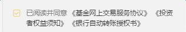

# 复选框

基于`mui`的复选框组件，并根据移动端项目做了样式上的重置，使用时需要引入样式文件`checkbox.less`。

`mui`中的复选框在左或在右都可以，但本框架中，复选框都是在左边的，因此只对位于左边的情况做了样式重置。



### DOM结构

```
<div class="mui-checkbox mui-left">
  	<div>此处可放置任意内容</div>
  	<input name="checkbox1" value="Item 1" type="checkbox" class="iconfont">
</div>

```

说明：

1. 复选框的容器是`mui-checkbox`，给其添加一个`class`为`mui-left`后，复选框便出现在左边

2. 由于移动端项目中，复选框旁边一般是各种协议，点击需要跳转到协议页面，因此把`input`标签前面的`label`标签换成了`div`，在`div`中，可任意放置所需内容

3. 在`input`标签上添加`checked="checked"`可以使其默认选中

4. 在`input`标签上添加`disabled`可以使其禁用


