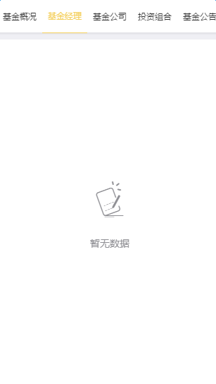

# 暂无数据

用于向服务器发送`ajax`请求数据但无数据时显示。需要引入样式文件`noData.less`

`DOM`结构：

```
<div class="noData">
	<div class="box vertical center">
		<p class="iconfont"></p>
		<p class="text">暂无数据</p>
	</div>
</div>
```

效果如图：




注：

由于每个页面每个区域的高度不同，背景颜色也可能不同，因此本组件只提供icon图标、暂无数据文案、颜色及默认上边距16.5rem。

实际使用时，需要针对不同情况在每个页面的样式文件中添加不同样式。