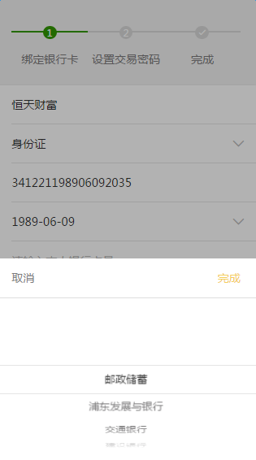
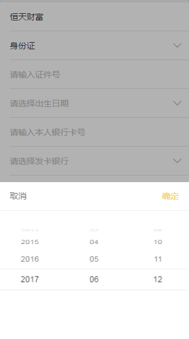

# 选择器

基于`mui`的选择器，根据移动端项目的要求做了一些改动。

### 需要依赖的文件

1. `mui`相关：`mui`的选择器`js`文件`mui.picker.min.js`，样式文件`mui.picker.all.css、mui.picker.css、mui.poppicker.css`

2. 本框架对`mui`进行重置的样式文件`resetMuiPop.less`，封装的poppicker调用的js文件`popPicker.js`。

### 使用方式

目前本框架提供两种选择器样式：下拉列表选择、生日日期选择。如图：

   

说明：

1. `popPicker.js`中，是下拉列表选择类的选择器的相关`js`

2. 若需使用日期选择器，使用`new mui.DtPicker({})`直接调用`mui`的日期选择器并传所需参数

3. 黑色透明背景层可点击，点击后选择器消失