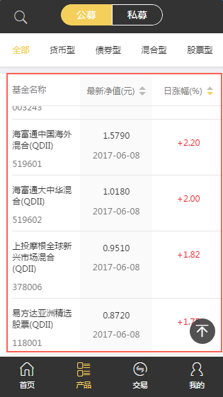

# 上拉加载+回到顶部

目前框架中提供两种上拉加载和回到顶部的方式：

1. 基于`mui`上拉加载，需要引入`js`文件`goTopMui.js（回到顶部）`，样式文件`goTopMui.less（回到顶部）`

2. 基于`iscroll.js`上拉加载（想知道iscroll.js是什么请百度~），需要引入`js`文件`scrollFullPage.js`

以下分别说明：

### 基于`mui`

如图，红框内是上拉区域，右下角的黑色按钮是回到顶部按钮：



说明：

1. DOM结构安排：

	```
		<div> <!-- 上啦加载区域的容器 -->
			<ul> <!-- 容器内的第一层元素 -->
				<li></li> <!-- 容器内的数据 -->
				……
				<!-- mui会把上拉加载更多的区域放在这里 -->
			</ul>

			<!-- 回到顶部按钮 -->
			<div class="goTopBtn iconfont"></div>
		</div>
	```

	按此结构，最外层的`div`为上拉加载区域的容器，对其进行滑动时，`mui`会把上滑下滑的效果添加给该容器内第一层元素。`上拉加载更多`的区域会被添加在该层元素的最底层，即所有数据的最底层。

	容器内可以不用`ul`列表，其他任意标签都可以，但需注意层级安排。

2. 初始化之前，需要设置上拉加载区域的高度，如：`var height =  windowHeight  - $('.nav').height();`

3. `mui`上拉加载的初始化及请求数据的顺序可以有不止一种方式：

	1）先初始化，在上拉的回调函数中请求数据，初始化后调用一次回调函数，进行第一次数据的请求。

	2）先请求第一次数据，然后初始化，上拉的回调函数中请求新数据

	两种方式都可以达到目的，可根据实际情况选择。

	常用`mui`上拉加载`JS`语句：

	```
		//初始化：
		mui.init({
			pullRefresh: {
				container: '.contentWrapper',   //上拉加载的容器
				up: {
					contentrefresh: '拼命加载中', //可选，加载数据时显示的提醒内容
					contentnomore:'没有更多了', //可选，请求完毕若没有更多数据时显示的提醒内容
			        callback : function(){
			        	//上拉后，执行ajax请求请求数据
						that.getData(this);
			        }
				}
			}
		});

		//请求第一次数据	
		mui('.contentWrapper').pullRefresh().pullupLoading();

		//上拉加载完毕，传true表示没有数据了
		t.endPullupToRefresh(true);
		//上拉加载完毕，传false表示还有数据，继续上拉会继续加载数据
		t.endPullupToRefresh(false);
	```

### 基于`iscroll.js`上拉

如图：


DOM结构：

```
<section class="container" id="wrapper"> <!--容器 -->
	<div class="redemption" id="scroller">
		<div id="pullBox">
			<div class="list" id="pageLists">
				<!-- 放置数据 -->
			</div>
		</div>
		<!-- 上拉加载更多 -->
		<div id="pullUp" style="text-align:center">
			<span class="pullUpIcon iconfont" style="font-size:2rem;color:#f4cf5c"></span><span class="pullUpLabel" style="diaplay:inline-block;vertical-align:middle"></span>
		</div>
	</div>
	<!-- 回到顶部的按钮 -->
	<div class="upTop" id="goTop">
		<span class="iconfont"></span>
	</div>
</section>

```

说明：

1. 初始化上拉加载的方法： 

```
var obj = {
    callback : function(){ //下拉分页的回调函数
        that.upPage(); 
    } 
}
$.slideFullPage(obj);//弹出层初始化     
```

