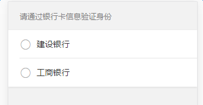

# 单选框

基于`mui`的单选框，并根据移动端项目做了样式上的重置，需要引入单选框样式文件`radio.less`

### DOM结构

```	
	<div class="mui-radio mui-left">
		<label>建设银行</label>
		<input name="radio1" type="radio">
	</div> 

	<!-- 默认选中 -->
	<div class="mui-radio mui-left">
		<label>工商银行</label>
		<input name="radio1" type="radio" checked="checked">
	</div> 

```
说明：

单选框和它的`label`被包裹在`class`为`mui-radio`的容器中，这整个容器占了一行的宽度。`mui-radio`容器有个`class`为`mui-left`，使单选框就出现在`label`的左边。

以上代码的效果如图：

  

### 与`mui`不同的地方

1. `mui`中的单选框在左或在右都可以，但本框架中，单选框都是在左边的，因此只对单选框位于左边的情况做了样式重置。

2. `mui`中，可以使用列表结构实现列表单选，但在本框架中，不采用这种方式，所有单选框都使用下面的DOM结构实现

3. 关于默认选中：

	`mui`中，给`mui-radio`添加`class`为`mui-selected`表示默认选中，但在本框架中，不采用这种方式，若是想使某个`input radio`默认选中，可以为其添加属性`checked="checked"`，在样式文件中，会使用`.mui-radio input[type=radio]:checked`的方式为其添加选中的样式

4. 关于禁用： 
	
	`mui`中，可以使用添加`disabled`属性的方式禁用`input radio`，但在本框架中，由于点击事件很多是用`zepto`绑定事件的方法绑定的，因此`disabled`属性不起作用，可以使用其他方式如使用`class`类控制等等实现