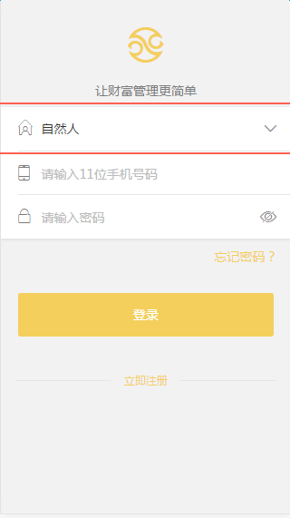
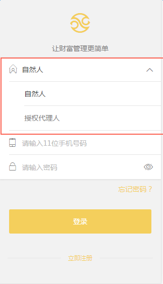

# 非基于mui

不基于mui的选择器，实现点击出现下拉列表，效果如图：

   

点击后会展开下拉列表，点击后收起。需要引入`select.js`和`select.less`。

`DOM`结构：

```	
	<!-- 未选择 -->
	<div class="selectWrapper">
	    <p  class="selectCopy" num="" >  
	    	<span class="select_txt">请选择</span>
	   	</p>
	   	<!-- 下拉列表 -->
		<ul class="optionCopy" style="display:none;"> 
			<li num="1" class="liSelect">自然人</li>
			<li num="0">授权代理人</li>
		</ul>
	</div>

	<!-- 已选择 -->
	<div class="selectWrapper">
	    <p  class="selectCopy" num="1" >
	    	<span class="select_txt selectResult">自然人</span>
	   	</p>
	   	<!-- 下拉列表 -->
		<ul class="optionCopy" style="display:none;"> 
			<li num="1" class="liSelect">自然人</li>
			<li num="0">授权代理人</li>
		</ul>
	</div>
```

说明：

1. p标签显示选择结果，并监听了点击展开收起下拉列表的事件

2. 未选择时，p标签的属性值num为空；

3. 选择结果后，或默认有选择结果，p标签的属性值不为空（为选择结果的li的num属性值），p标签内的span标签添加class属性值selectResult，对应的选择结果li添加class属性值liSelect，文字会变成黑色，表示已选