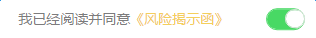

# 开关

基于`mui`的开关组件，做了样式上的重置。需要引入`switch`的样式文件`switch.less`

### DOM结构

```
<div class="mui-switch-wrap">
	<!-- label-->
	<label>我已经阅读并同意<a class="txt" href="javascript:;" 
		onclick="window.location.href=site_url.riskIntro_url;">《风险揭示函》</a>
	</label>

	<!-- 简洁模式开关 -->
	<div class="mui-switch mui-switch-mini mui-active">
		<div class="mui-switch-handle"></div>
	</div>
</div>

```

效果如图：

  

说明：

1. 需要引入`switch`的样式文件`switch.less`

2. 开关容器的`class`：`mui-switch-wrap`

3. 容器中，第一个节点为`label`，其中可以放置任意内容，若有文字需要显示为黄色`#f4cf5c`，可以添加`class`为`txt`，如这里的`a`标签

4. 容器中的第二个节点为`mui-switch mui-switch-mini` ，表示此处为简洁开关（不带文字），若需显示文字则把（`mui-switch-mini`去掉，但目前移动端项目中的开关都是简洁开关）

5. 开关若需要默认打开，可以给`mui-switch`添加`class`为`mui-active`


