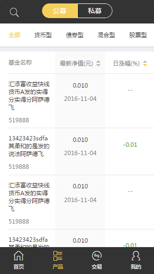

# 导航上的按钮数据不确定时

基于`mui`的左右滑动，用于滑动切换不同标签，显示不同内容。需要引入`js`文件`tabScroll.js`和样式文件`tabScroll.less`

如图：

导航上每一个标签都对应一个区域，左右滑动时可以切换区域，显示不同数据。

`tabScroll.js`中声明了初始化滑动区域的方法，调用方式`$.tabScroll(obj);`，`obj`是所需参数。

本组件可以和上拉加载插件组合使用。
