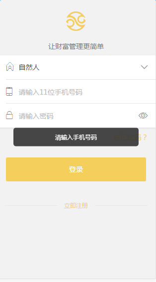

# 黑色提示条

多用于在某些交互动作发生后，需要提示某些信息的时候。需要引入样式文件`tip.less`和js文件`tipAction.js`。

效果：

 

说明：

1. `html`页面中不需要添加此提示条的DOM结构，`tipAction.js`中会生成`DOM`结构并插入到页面底部，并声明该提示条出现和隐藏的方法。

2. 此提示条的高度可根据内容的长度而改变

3. 调用方法

```
tipAction('提示文案', function(){
	//2s后该提示条隐藏并执行的回调函数
})
```